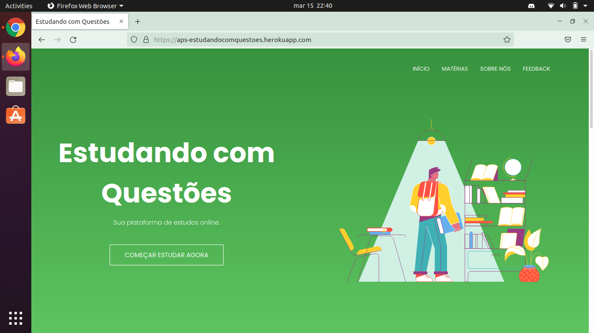
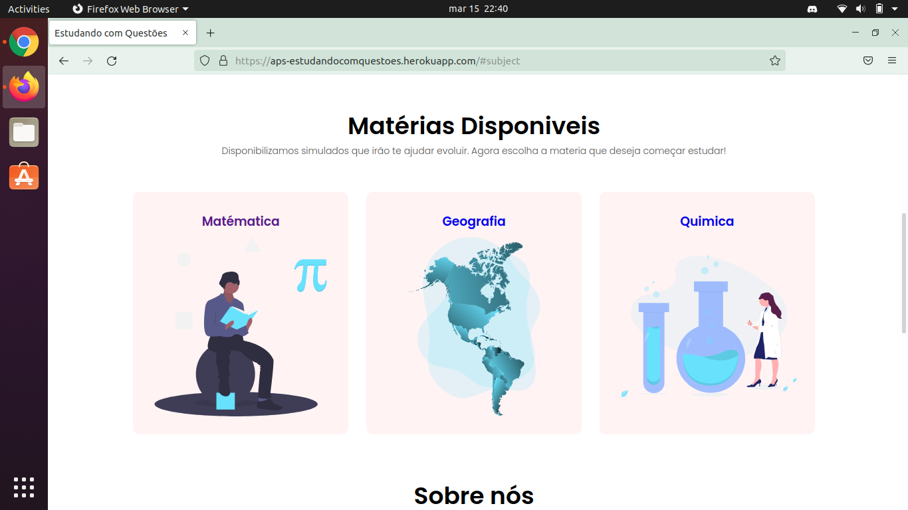
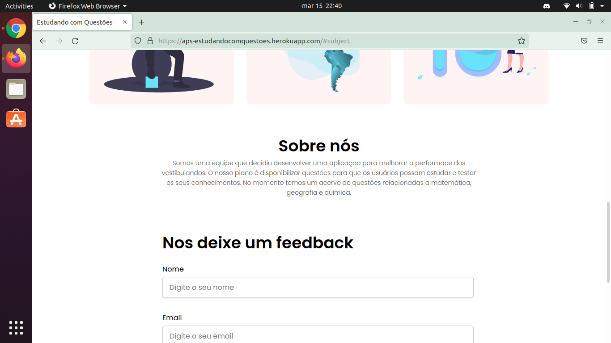
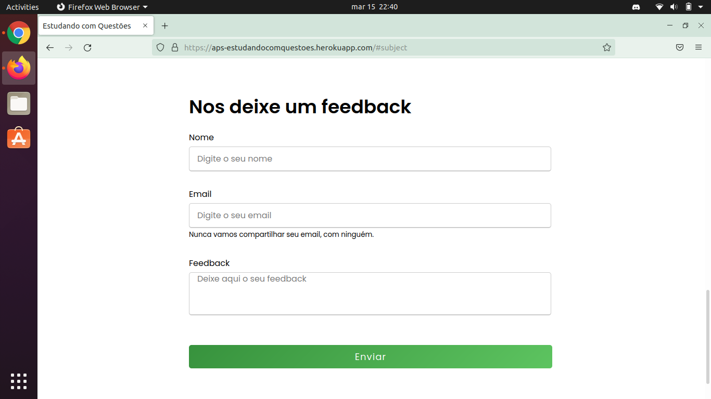

> 🚀 Projeto desenvolvido para melhorar a performace dos vestibulandos, realizado para matérias do IFBA - Campus Euclides da Cunha

### Algumas Screenshots

<div style="display: flex; flex-direction: 'row'; align-items: 'center';">
   <div>
      
      
   </div>
   <div>
      
      
   </div>
   
</div>

# 💻 Tecnologias

<ul>
  <li><a href="https://developer.mozilla.org/en-US/docs/Web/HTML">HTML</a></li>
  <li><a href="https://developer.mozilla.org/en-US/docs/Web/CSS">CSS</a></li>
  <li><a href="https://developer.mozilla.org/en-US/docs/Web/JavaScript">JavaScript</a></li>
</ul>

Caso você queirar deixar esse projeto com a sua cara poderá clona-lo e fazer as modificações que desejar. Siga os seguintes passos:

# 👷Clonando o repositório

Para clonar o ropositório você deverá utilizar o sequinte comando:

```bash
# Comando
$ git clone https://github.com/reinankaua/aps-estudandocomquestoes.git
```
Com esse comando executado o seu ambiente já estará pronto para desenvolvimento, apenas bastando abrir a pasta com o seu editor de código ou IDE favorita.


---

Feito com 💜
