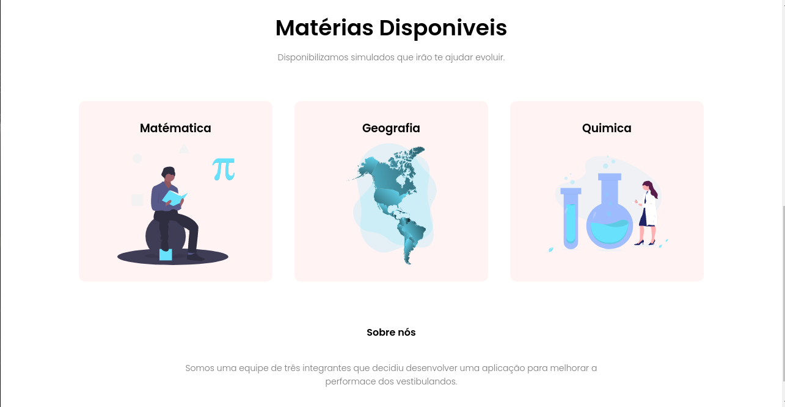

> 🚀 Projeto desenvolvido para melhorar a performace dos vestibulandos, realizado para matérias do IFBA - Campus Euclides da Cunha

### Screenshots Desktop

<div style="display: flex; flex-direction: 'row'; align-items: 'center';">
   
   
</div>

<!--- ### Screenshot Mobile
<div style="display: flex; flex-direction: 'row'; align-items: 'center';">
   
   
</div> -->

# 💻 Tecnologias

<ul>
  <li><a href="https://developer.mozilla.org/en-US/docs/Web/HTML">HTML</a></li>
  <li><a href="https://developer.mozilla.org/en-US/docs/Web/CSS">CSS</a></li>
  <li><a href="https://developer.mozilla.org/en-US/docs/Web/JavaScript">JavaScript</a></li>
</ul>

# 👷Como rodar localmente

```bash
# Clone o repositorio
$ git clone https://github.com/reinankaua/EstudandoComQuestoes.git
```

### Abrindo o projeto

```bash
# Na raiz do projeto

# Faça o seguinte comando para abrir o arquivo no linux
$ xdg-open index.html


# Faça o seguinte comando para abrir o arquivo no windows
$ start index.html


# Faça o seguinte comando para abrir o arquivo no mac
$ open index.html
```

---

Feito com 💜
